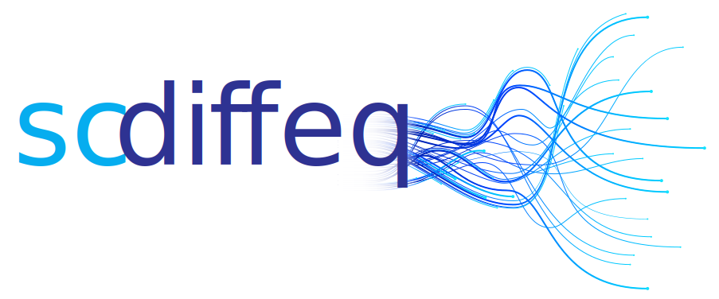

# 

[](https://pypi.python.org/pypi/scdiffeq/)
[](https://badge.fury.io/py/scdiffeq)
[](https://github.com/psf/black)

An analysis framework for modeling dynamical single-cell data with **stochastic neural differential equations**.

## Install the development package:

```
git clone git@github.com:pinellolab/sc-neural-ODEs.git

pip install -e .
```